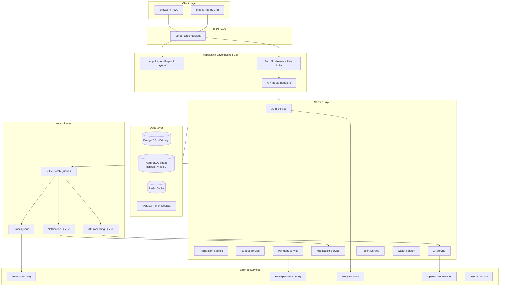
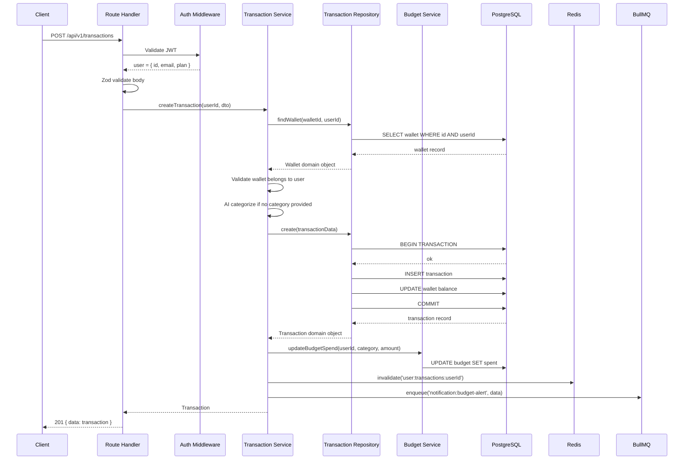
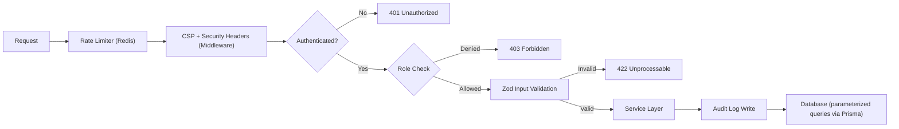

# 03 — Architecture

> **Document Type:** System Architecture  
> **Audience:** All engineers, architects  
> **Status:** Living Document

---

## Purpose

This document describes the overall system architecture of FinanceFlow — how components relate to each other, what responsibilities each layer holds, and why the current architecture was chosen over alternatives. It is the single source of truth for structural decisions.

---

## 1. Architecture Philosophy

FinanceFlow uses a **Feature-Based Modular Monolith** architecture. This is a deliberate choice for the current scale (2,000–50,000 users) with a clear migration path to microservices at defined growth thresholds.

### Why Not Microservices from Day One?

| Concern | Microservices Risk | Modular Monolith Benefit |
|---------|-------------------|--------------------------|
| Operational complexity | High: service discovery, inter-service auth, distributed tracing | Low: single deployment unit |
| Team size | Requires 8–10+ dedicated engineers per service | 3–8 engineers total is fine |
| Development velocity | Slow: every feature crosses service boundaries | Fast: single codebase, atomic changes |
| Debugging | Hard: distributed logs, trace correlation | Easy: single log stream |
| Testing | Complex: contract tests, mock services | Simple: single test environment |
| Cost | High: multiple Kubernetes clusters, service meshes | Low: single Vercel deployment |

### Why Not Plain MVC?

MVC leads to fat controllers and tightly coupled business logic as the codebase grows. Feature-based architecture with a service layer and repository pattern keeps business logic isolated, testable, and portable.

### The Migration Path

```
Phase 1 (Now):     Modular Monolith (Next.js Route Handlers)
Phase 2 (10k+):    Extract AI service (cost/scaling isolation)
Phase 3 (100k+):   Extract Notifications service, Payment service
Phase 4 (500k+):   Full microservices with shared event bus (Kafka/SQS)
```

Clean module boundaries today make extraction possible tomorrow without rewriting business logic.

---

## 2. High-Level Architecture Diagram



---

## 3. Module Map

The codebase is organized by **feature modules**, not by technical layer. Each feature owns its routes, service, repository, types, and tests.

```
src/
├── app/                                # Next.js App Router
│   ├── (auth)/                         # Auth pages (login, register, verify)
│   ├── (dashboard)/                    # Protected dashboard pages
│   │   ├── page.tsx                    # Dashboard home
│   │   ├── transactions/
│   │   ├── budgets/
│   │   ├── goals/
│   │   ├── wallets/
│   │   ├── investments/
│   │   ├── emis/
│   │   ├── subscriptions/
│   │   ├── reports/
│   │   └── settings/
│   ├── (admin)/                        # Admin panel pages
│   ├── api/                            # API Route Handlers
│   │   ├── v1/
│   │   │   ├── auth/
│   │   │   ├── users/
│   │   │   ├── wallets/
│   │   │   ├── transactions/
│   │   │   ├── budgets/
│   │   │   ├── goals/
│   │   │   ├── investments/
│   │   │   ├── emis/
│   │   │   ├── subscriptions/
│   │   │   ├── reports/
│   │   │   ├── analytics/
│   │   │   ├── notifications/
│   │   │   ├── ai/
│   │   │   ├── payments/
│   │   │   ├── webhooks/
│   │   │   ├── admin/
│   │   │   └── health/
│   │   └── webhooks/                   # External webhook handlers
│   └── layout.tsx
│
├── features/                           # Feature modules (business logic)
│   ├── auth/
│   │   ├── auth.service.ts
│   │   ├── auth.repository.ts
│   │   ├── auth.types.ts
│   │   ├── auth.validators.ts
│   │   └── auth.errors.ts
│   ├── transactions/
│   │   ├── transaction.service.ts
│   │   ├── transaction.repository.ts
│   │   ├── transaction.types.ts
│   │   ├── transaction.validators.ts
│   │   ├── transaction.categorizer.ts
│   │   └── transaction.errors.ts
│   ├── budgets/
│   ├── goals/
│   ├── wallets/
│   ├── investments/
│   ├── emis/
│   ├── subscriptions/
│   ├── reports/
│   ├── analytics/
│   ├── notifications/
│   ├── ai/
│   ├── payments/
│   └── admin/
│
├── shared/                             # Cross-cutting shared code
│   ├── components/                     # Shared UI components
│   ├── hooks/                          # Shared React hooks
│   ├── types/                          # Global TypeScript types
│   ├── constants/                      # App-wide constants
│   ├── utils/                          # Pure utility functions
│   ├── errors/                         # Base error classes
│   └── validators/                     # Shared Zod schemas
│
├── lib/                                # Infrastructure integrations (thin wrappers)
│   ├── prisma.ts                       # Prisma client singleton
│   ├── redis.ts                        # Redis client singleton
│   ├── s3.ts                           # AWS S3 client
│   ├── resend.ts                       # Resend email client
│   ├── razorpay.ts                     # Razorpay client
│   ├── openai.ts                       # AI provider client
│   ├── bullmq.ts                       # BullMQ setup
│   └── logger.ts                       # Pino logger
│
└── server/                             # Server-only utilities
    ├── middleware/
    │   ├── auth.middleware.ts
    │   ├── rate-limit.middleware.ts
    │   └── logging.middleware.ts
    └── guards/
        ├── admin.guard.ts
        └── premium.guard.ts
```

---

## 4. Layer Responsibilities

### 4.1 API Route Handlers (`app/api/`)

**Responsibilities:**
- Parse and validate incoming HTTP requests
- Call the appropriate service method
- Return standardized HTTP responses
- Handle errors and map to HTTP status codes

**Must NOT:**
- Contain business logic
- Directly call repositories or the database
- Perform data transformations beyond response formatting
- Store state

```typescript
// CORRECT — thin route handler
export async function POST(request: Request) {
  const body = await request.json()
  const validated = CreateTransactionSchema.parse(body)
  const result = await transactionService.create(userId, validated)
  return ApiResponse.created(result)
}

// WRONG — fat route handler with business logic
export async function POST(request: Request) {
  const body = await request.json()
  // DON'T: validation logic, business rules, direct DB calls here
  const tx = await prisma.transaction.create({ data: body })
  await prisma.budget.update({ where: { id: body.budgetId }, data: { spent: { increment: body.amount } } })
  return Response.json(tx)
}
```

### 4.2 Service Layer (`features/*/service.ts`)

**Responsibilities:**
- Implement all business logic
- Orchestrate repository calls
- Enforce business rules and invariants
- Emit events / trigger async jobs
- Return domain objects (not raw Prisma objects)

**Must NOT:**
- Directly import `prisma` client (use repositories)
- Handle HTTP concerns
- Access `Request` or `Response` objects

### 4.3 Repository Layer (`features/*/repository.ts`)

**Responsibilities:**
- All database read/write operations
- Query construction and optimization
- Data mapping between database records and domain types
- Transaction management (Prisma transactions)

**Must NOT:**
- Contain business logic or validation
- Be called from Route Handlers directly
- Leak Prisma types to the service layer (map to domain types)

### 4.4 Middleware (`server/middleware/`)

**Responsibilities:**
- Authentication (verify JWT, attach user to request)
- Rate limiting
- Request logging
- Security headers

---

## 5. Data Flow: Creating a Transaction



---

## 6. Caching Architecture

### What to Cache

| Resource | Cache Key | TTL | Invalidation |
|----------|-----------|-----|-------------|
| User profile | `user:profile:{userId}` | 15 min | On profile update |
| Dashboard summary | `user:dashboard:{userId}:{month}` | 5 min | On new transaction |
| Budget summaries | `user:budgets:{userId}:{month}` | 5 min | On transaction/budget change |
| Transaction list | `user:transactions:{userId}:{page}:{filters}` | 2 min | On new transaction |
| AI conversation context | `ai:context:{userId}` | 60 min | On new message |
| Exchange rates | `fx:rates:{date}` | 24 hours | Daily refresh |
| Category list | `categories:all` | 24 hours | On admin change |

### Cache Strategy

**Cache-Aside (Lazy Loading):** Default strategy. Read from cache; on miss, read from DB, write to cache, return.

**Write-Through:** For user profile and wallet balances — write to cache at the same time as DB write to prevent stale reads.

**Cache Invalidation:** Use tag-based invalidation patterns. When a transaction is created, invalidate all cache keys tagged with `userId` to avoid serving stale summaries.

```typescript
// Cache invalidation on transaction create
async function invalidateTransactionCaches(userId: string) {
  await redis.del([
    `user:dashboard:${userId}:*`,
    `user:transactions:${userId}:*`,
    `user:budgets:${userId}:*`,
    `user:analytics:${userId}:*`,
  ])
}
```

---

## 7. Queue Architecture (BullMQ)

### Queue Definitions

| Queue Name | Purpose | Concurrency | Retry | Priority |
|-----------|---------|-------------|-------|----------|
| `email` | Transactional emails via Resend | 5 | 3x with exp backoff | Medium |
| `notification` | In-app notification delivery | 10 | 3x | High |
| `ai-process` | Async AI categorization | 3 | 2x | Low |
| `report-generate` | Monthly report generation | 2 | 1x | Low |
| `payment-webhook` | Razorpay webhook processing | 5 | 5x | High |
| `subscription-renewal` | Premium plan renewal checks | 2 | 3x | Medium |
| `data-export` | User data export (CSV/PDF) | 2 | 1x | Low |

### Queue Worker Architecture

```
src/
└── workers/
    ├── email.worker.ts
    ├── notification.worker.ts
    ├── ai.worker.ts
    ├── report.worker.ts
    ├── payment.worker.ts
    └── index.ts           # Worker bootstrap (separate process)
```

Workers run as a **separate Node.js process** from the Next.js app. In Vercel, this runs as a separate serverless function. In Docker/self-hosted, this runs as a dedicated container.

---

## 8. Security Architecture Overview

> See `08_SECURITY.md` for full details.



---

## 9. Design Decisions Log

### DD-001: Next.js Route Handlers vs. Separate Express API

**Decision:** Use Next.js Route Handlers for the API  
**Rationale:** Unified codebase, shared types between frontend and backend, Vercel deployment simplicity, sufficient for current and mid-scale.  
**Trade-off:** Tightly couples frontend and backend deployment. Extraction to a separate API service is possible in Phase 3 by moving `features/` and `server/` to a dedicated repo.  
**Alternatives Considered:** Express.js with NestJS (too much boilerplate), Fastify (good, but separate deployment complexity)

### DD-002: Prisma vs. Drizzle vs. TypeORM

**Decision:** Prisma  
**Rationale:** Best TypeScript DX, schema-first design, strong migration story, excellent Postgres support, large ecosystem.  
**Trade-off:** Prisma's query engine adds a slight overhead; not ideal for extremely complex raw SQL. Use `prisma.$queryRaw` for complex analytics queries.  
**Alternatives Considered:** Drizzle (faster, but less mature ecosystem), TypeORM (verbose, less safe)

### DD-003: Modular Monolith vs. Microservices

**Decision:** Modular Monolith  
**Rationale:** Team size (< 10 engineers), current scale (< 10,000 users), deployment simplicity, development velocity.  
**Trade-off:** Scaling specific features independently requires extraction work later.  
**Migration Trigger:** When AI service cost/latency requires independent scaling, extract it first.

### DD-004: BullMQ vs. AWS SQS vs. Inngest

**Decision:** BullMQ with Redis  
**Rationale:** Already using Redis for caching (no extra infra), excellent DX, built-in retry/backoff/priority, good observability with BullMQ Board.  
**Trade-off:** Tied to Redis availability. In Phase 3, consider Inngest or AWS SQS for managed queue reliability.  
**Alternatives Considered:** Inngest (great DX, higher cost at scale), SQS (great reliability, more AWS coupling)

### DD-005: Feature-Based vs. Layer-Based Folder Structure

**Decision:** Feature-based (`features/auth/`, `features/transactions/`)  
**Rationale:** Related code lives together. A developer working on transactions touches one folder. Layer-based (`services/`, `repositories/`, `controllers/`) scatters one feature's code across many folders.  
**Trade-off:** Shared utilities require discipline not to duplicate.  
**Alternative:** A hybrid (domain feature folders with internal layering) — this is what we do within each feature folder.
