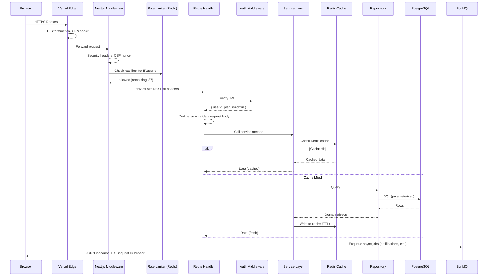
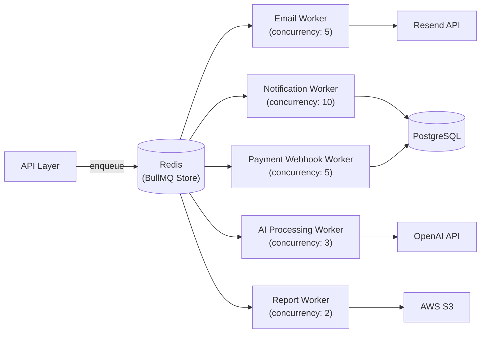
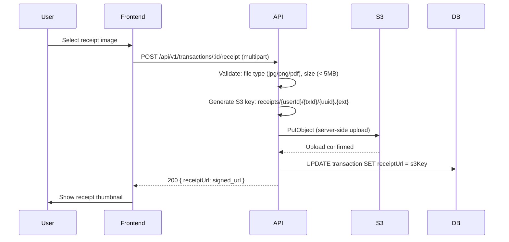

# 04 — System Design

> **Document Type:** Deep System Design  
> **Audience:** Backend engineers, architects, AI coding agents  
> **Status:** Living Document

---

## Purpose

This document goes deeper than the architecture overview in `03_ARCHITECTURE.md`. It covers the detailed design of every critical subsystem: request lifecycle, data consistency, real-time updates, background job processing, file handling, and scaling strategy per growth phase.

---

## 1. Request Lifecycle (Full Stack)



---

## 2. Data Consistency Strategy

### Financial Data Consistency Requirements

Financial data requires **strong consistency**, not eventual consistency. A user's wallet balance must always be accurate. We cannot use eventual consistency patterns (like event sourcing without proper saga handling) at this stage.

### Strategy: Atomic DB Transactions

All multi-step financial operations use Prisma's `$transaction()`:

```typescript
// Example: Create transaction + update wallet balance atomically
async function createTransactionWithBalanceUpdate(
  userId: string,
  dto: CreateTransactionDto
): Promise<Transaction> {
  return prisma.$transaction(async (tx) => {
    // 1. Lock the wallet row (SELECT FOR UPDATE)
    const wallet = await tx.wallet.findFirst({
      where: { id: dto.walletId, userId, deletedAt: null },
    })
    if (!wallet) throw new NotFoundError('Wallet')
    if (wallet.userId !== userId) throw new ForbiddenError()

    // 2. Compute new balance
    const balanceDelta = dto.type === 'INCOME'
      ? new Decimal(dto.amount)
      : new Decimal(dto.amount).negated()

    // 3. Create transaction
    const transaction = await tx.transaction.create({
      data: {
        userId,
        walletId: dto.walletId,
        type: dto.type,
        amount: new Decimal(dto.amount),
        transactionDate: new Date(dto.transactionDate),
        // ...other fields
      },
    })

    // 4. Update wallet balance (with optimistic lock check)
    const updated = await tx.wallet.updateMany({
      where: { id: dto.walletId, version: wallet.version },
      data: {
        balance: { increment: balanceDelta },
        version: { increment: 1 },
        updatedAt: new Date(),
      },
    })

    if (updated.count === 0) {
      // Concurrent modification detected — retry
      throw new OptimisticLockError('Wallet was modified concurrently')
    }

    return transaction
  }, {
    isolationLevel: 'ReadCommitted',
    timeout: 10000,
  })
}
```

### Retry on Optimistic Lock Failure

```typescript
async function createTransactionWithRetry(userId: string, dto: CreateTransactionDto, attempts = 3) {
  for (let i = 0; i < attempts; i++) {
    try {
      return await createTransactionWithBalanceUpdate(userId, dto)
    } catch (error) {
      if (error instanceof OptimisticLockError && i < attempts - 1) {
        await sleep(50 * Math.pow(2, i))  // Exponential backoff: 50ms, 100ms, 200ms
        continue
      }
      throw error
    }
  }
}
```

---

## 3. Caching System Design

### Cache Hierarchy

```
L1: In-process memory (not used — stateless serverless functions)
L2: Redis (primary cache)
L3: Database
```

### Cache Key Naming Convention

```
Format: {namespace}:{resource}:{identifier}:{qualifier}
Examples:
  user:profile:uuid
  user:dashboard:uuid:2025-06
  user:transactions:uuid:page:1:type:EXPENSE
  ai:context:uuid:fingerprint
  fx:rates:INR:2025-06-01
  categories:system:all
  rl:auth:192.168.1.1
```

### Cache Invalidation Patterns

**Pattern 1: Key-Level Invalidation**
When a specific resource changes, delete its specific cache key.
```typescript
// On profile update
await redis.del(`user:profile:${userId}`)
```

**Pattern 2: Pattern-Level Invalidation (Wildcard)**
When a broad resource changes (e.g., new transaction), invalidate all related caches.
```typescript
// On new transaction — invalidates all paginated transaction lists, dashboard, analytics
const keys = await redis.keys(`user:*:${userId}:*`)
if (keys.length > 0) await redis.del(...keys)
```

> ⚠️ **Warning:** `redis.keys()` is O(N) and blocks Redis. In production with large key sets, use `SCAN` instead:

```typescript
async function deleteKeysByPattern(pattern: string): Promise<void> {
  const pipeline = redis.pipeline()
  let cursor = '0'
  do {
    const [nextCursor, keys] = await redis.scan(cursor, 'MATCH', pattern, 'COUNT', 100)
    cursor = nextCursor
    if (keys.length > 0) pipeline.del(...keys)
  } while (cursor !== '0')
  await pipeline.exec()
}
```

**Pattern 3: Tag-Based Invalidation (Phase 2)**
Group cache keys by tags. Invalidate all keys with a given tag. Requires a tag-to-keys index in Redis.

### What NOT to Cache

| Data | Reason |
|------|--------|
| Wallet balances | Changes on every transaction — stale balance would show wrong data |
| Active sessions | Must always be read from DB for security |
| Payment status | Must be real-time |
| Auth tokens | Stored in DB, validated on every request |

---

## 4. Background Job System Design

### Job Queue Architecture



### Job Definitions

```typescript
// src/lib/queues.ts
import { Queue } from 'bullmq'
import { redis } from './redis'

const connection = { connection: redis }

export const emailQueue = new Queue('email', connection)
export const notificationQueue = new Queue('notification', connection)
export const aiQueue = new Queue('ai-process', connection)
export const reportQueue = new Queue('report-generate', connection)
export const paymentQueue = new Queue('payment-webhook', connection)

// Job type definitions
export type EmailJobData = {
  to: string
  subject: string
  template: 'WELCOME' | 'VERIFY_EMAIL' | 'RESET_PASSWORD' | 'WEEKLY_DIGEST' | 'BUDGET_ALERT'
  variables: Record<string, string>
}

export type NotificationJobData = {
  userId: string
  type: NotificationType
  title: string
  body: string
  data?: Record<string, unknown>
}

export type AICategorizationJobData = {
  transactionId: string
  userId: string
  merchant: string
  description: string
  amount: string
}

export type ReportJobData = {
  userId: string
  type: 'PDF' | 'CSV'
  period: 'MONTHLY' | 'YEARLY'
  month?: number
  year: number
  exportId: string
}
```

### Retry Strategy

```typescript
// Job retry configuration
const JOB_OPTIONS = {
  email: {
    attempts: 3,
    backoff: { type: 'exponential', delay: 5000 },  // 5s, 10s, 20s
    removeOnComplete: { count: 100 },
    removeOnFail: { count: 500 },
  },
  payment: {
    attempts: 5,
    backoff: { type: 'exponential', delay: 10000 },  // 10s, 20s, 40s, 80s, 160s
    removeOnComplete: { count: 500 },
    removeOnFail: false,  // Keep failed payment jobs for manual inspection
  },
  ai: {
    attempts: 2,
    backoff: { type: 'fixed', delay: 2000 },
    removeOnComplete: { count: 200 },
    removeOnFail: { count: 100 },
  },
}
```

### Dead Letter Queue (Failed Jobs)

Failed jobs that exhaust retries are moved to a `failed` state in BullMQ. A daily job reviews failed payment jobs and triggers alerts. Admin can retry individual failed jobs from the BullMQ Board dashboard.

---

## 5. File Storage System Design

### Receipt Upload Flow



### S3 Folder Structure

```
s3://financeflow-uploads/
├── receipts/
│   └── {userId}/
│       └── {transactionId}/
│           └── {uuid}.jpg
├── exports/
│   └── {userId}/
│       └── {exportId}.pdf
└── avatars/
    └── {userId}/
        └── {uuid}.jpg
```

### Pre-Signed URLs

Files are never publicly accessible. Access is via short-lived (1-hour) pre-signed URLs generated server-side on request:

```typescript
import { GetObjectCommand, S3Client } from '@aws-sdk/client-s3'
import { getSignedUrl } from '@aws-sdk/s3-request-presigner'

async function getReceiptUrl(s3Key: string): Promise<string> {
  const command = new GetObjectCommand({
    Bucket: env.AWS_S3_BUCKET,
    Key: s3Key,
  })
  return getSignedUrl(s3Client, command, { expiresIn: 3600 })
}
```

---

## 6. Real-Time Updates (Phase 2)

At current scale, the dashboard uses polling (refetch every 30 seconds with React Query). At Phase 2, introduce Server-Sent Events (SSE) for real-time notification delivery:

```typescript
// Phase 2: SSE endpoint for real-time notifications
export async function GET(request: Request) {
  const stream = new ReadableStream({
    start(controller) {
      const sendEvent = (data: unknown) => {
        controller.enqueue(`data: ${JSON.stringify(data)}\n\n`)
      }

      // Subscribe to Redis pub/sub for user's notifications
      const subscriber = redis.duplicate()
      subscriber.subscribe(`notifications:${userId}`)
      subscriber.on('message', (_, message) => {
        sendEvent(JSON.parse(message))
      })

      // Keep-alive ping every 30 seconds
      const ping = setInterval(() => {
        controller.enqueue(': ping\n\n')
      }, 30000)

      request.signal.addEventListener('abort', () => {
        clearInterval(ping)
        subscriber.unsubscribe()
        subscriber.disconnect()
        controller.close()
      })
    }
  })

  return new Response(stream, {
    headers: {
      'Content-Type': 'text/event-stream',
      'Cache-Control': 'no-cache',
      'Connection': 'keep-alive',
    }
  })
}
```

---

## 7. Scaling Strategy by Phase

### Phase 1: Current (0–10k users)
```
Vercel Serverless (auto-scaling)
PostgreSQL: Single managed instance (Supabase/Neon/Railway)
Redis: Single managed instance (Upstash)
BullMQ Workers: Vercel Serverless Functions (or single VPS)
S3: Single bucket, single region
```

**Bottlenecks to watch:** Database connection pooling (Prisma + serverless = connection exhaustion). Use PgBouncer or Supabase connection pooler.

### Phase 2: Growth (10k–100k users)
```
+ PostgreSQL Read Replica: Route analytics/report queries to replica
+ Redis Cluster: For cache and queue reliability
+ PgBouncer: Connection pooling
+ BullMQ: Dedicated VPS workers (not serverless — cold starts hurt queues)
+ S3: Enable S3 Transfer Acceleration for faster uploads from India
+ CDN: Vercel Edge Config for feature flags
```

**New consideration:** Database indexes become critical. Run `EXPLAIN ANALYZE` on slow queries.

### Phase 3: Scale (100k–1M users)
```
+ Read Replicas: 2–3 replicas for analytics
+ Separate AI Service: Independent Node.js service with own scaling
+ Separate Notification Service: WebSocket/SSE service
+ Database Sharding Strategy: Shard by userId hash for transactions table
+ Event Bus: Introduce Kafka/SQS for inter-service communication
+ CDN: All static assets, edge-cached API responses
+ Elasticsearch: Full-text transaction search (replaces PostgreSQL LIKE queries)
```

### Phase 4: Hyperscale (1M+ users)
```
+ Full Microservices: Auth, Transactions, Budgets, AI, Payments as separate services
+ Multi-Region: Deployment in 2+ regions (primary: Mumbai, secondary: Singapore)
+ CQRS: Command and Query Responsibility Segregation for transaction ledger
+ Event Sourcing: Full event log for transaction history (immutable audit trail)
+ Global Redis: Multi-region Redis with replication
```

---

## 8. Financial Calculation Engine

All financial calculations must use the `Decimal` library with explicit precision. This section defines the exact formulas used across the system.

### Savings Rate
```typescript
// savings_rate = (income - expenses) / income * 100
const savingsRate = income.minus(expenses).div(income).times(100).toDecimalPlaces(2)
```

### Budget Utilization
```typescript
// utilization = spent / limit * 100
const utilization = spentAmount.div(limitAmount).times(100).toDecimalPlaces(1)
```

### Investment Returns
```typescript
// absolute_return = current_value - purchase_amount
// return_percent = (current_value - purchase_amount) / purchase_amount * 100
const absoluteReturn = currentValue.minus(purchaseAmount)
const returnPercent = currentValue.minus(purchaseAmount).div(purchaseAmount).times(100).toDecimalPlaces(2)
```

### Net Worth
```typescript
// net_worth = sum(all wallet balances)
// Note: Credit card balances are negative, so they correctly reduce net worth
const netWorth = wallets.reduce(
  (acc, w) => acc.plus(w.balance),
  new Decimal(0)
)
```

### Financial Health Score (0–100)
```typescript
// Weighted composite score
function calculateHealthScore(metrics: FinancialMetrics): number {
  const savingsRateScore = Math.min(metrics.savingsRate.toNumber() * 2, 40)  // Max 40 pts (20%+ savings = full score)
  const budgetAdherenceScore = Math.max(0, 30 - (metrics.budgetsExceeded * 10))  // Max 30 pts
  const emergencyFundScore = Math.min((metrics.emergencyFundMonths / 6) * 20, 20)  // Max 20 pts (6 months = full)
  const debtRatioScore = Math.max(0, 10 - (metrics.debtToIncomeRatio.toNumber() * 20))  // Max 10 pts

  return Math.round(savingsRateScore + budgetAdherenceScore + emergencyFundScore + debtRatioScore)
}
```
