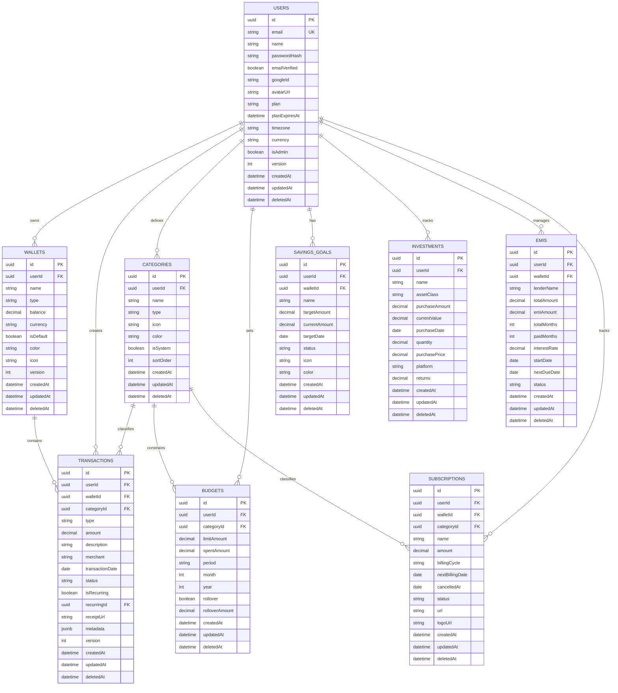

# 05 — Database Design

> **Document Type:** Database Architecture & Schema  
> **Audience:** Backend engineers, DBAs, AI coding agents  
> **Status:** Living Document

---

## Purpose

This document defines the complete PostgreSQL database schema for FinanceFlow, including every table, column, relationship, index, constraint, and migration strategy. Every schema change must be documented here before implementation.

---

## 1. Design Principles

| Principle | Implementation |
|-----------|---------------|
| UUIDs for all primary keys | Prevents enumeration attacks, safe for distributed ID generation |
| Soft deletes everywhere | `deletedAt TIMESTAMP NULL` — financial records must never be hard-deleted |
| Decimal for all money | `DECIMAL(15, 2)` — never FLOAT or DOUBLE for currency |
| Audit trail for sensitive tables | Separate `*_audit` tables for all mutations |
| Timestamps on every table | `createdAt`, `updatedAt`, `deletedAt` |
| Optimistic locking | `version INTEGER` column on tables with concurrent mutation risk |
| Row-level tenant isolation | Every table tied to `userId` or `organizationId` |
| Indexes on all foreign keys | PostgreSQL does not auto-index FKs |
| Composite indexes for common queries | Avoid slow sequential scans on filtered queries |

---

## 2. ER Diagram (Core Domain)



---

## 3. Complete Prisma Schema

```prisma
// prisma/schema.prisma

generator client {
  provider = "prisma-client-js"
}

datasource db {
  provider = "postgresql"
  url      = env("DATABASE_URL")
}

// =============================================
// ENUMS
// =============================================

enum UserPlan {
  FREE
  PREMIUM
  FAMILY
  BUSINESS
}

enum WalletType {
  BANK_ACCOUNT
  CASH
  CREDIT_CARD
  DIGITAL_WALLET
  INVESTMENT
  SAVINGS
}

enum TransactionType {
  INCOME
  EXPENSE
  TRANSFER
}

enum TransactionStatus {
  COMPLETED
  PENDING
  FAILED
  CANCELLED
}

enum CategoryType {
  INCOME
  EXPENSE
  BOTH
}

enum BudgetPeriod {
  MONTHLY
  QUARTERLY
  YEARLY
}

enum GoalStatus {
  ACTIVE
  COMPLETED
  CANCELLED
  PAUSED
}

enum EMIStatus {
  ACTIVE
  COMPLETED
  DEFAULTED
}

enum SubscriptionStatus {
  ACTIVE
  CANCELLED
  PAUSED
  TRIAL
}

enum NotificationType {
  BUDGET_ALERT
  BILL_REMINDER
  GOAL_MILESTONE
  UNUSUAL_SPEND
  AI_INSIGHT
  SYSTEM
  PAYMENT_SUCCESS
  PAYMENT_FAILED
}

enum AssetClass {
  EQUITY
  DEBT
  GOLD
  REAL_ESTATE
  CRYPTO
  FIXED_DEPOSIT
  PPF
  NPS
  OTHER
}

enum PaymentStatus {
  PENDING
  COMPLETED
  FAILED
  REFUNDED
}

enum AuditAction {
  CREATE
  UPDATE
  DELETE
  LOGIN
  LOGOUT
  PASSWORD_CHANGE
  PLAN_CHANGE
  EXPORT
}

// =============================================
// USERS
// =============================================

model User {
  id            String    @id @default(uuid())
  email         String    @unique
  name          String
  passwordHash  String?
  emailVerified Boolean   @default(false)
  googleId      String?   @unique
  avatarUrl     String?
  plan          UserPlan  @default(FREE)
  planExpiresAt DateTime?
  timezone      String    @default("Asia/Kolkata")
  currency      String    @default("INR")
  isAdmin       Boolean   @default(false)
  onboardingCompleted Boolean @default(false)
  version       Int       @default(0)
  createdAt     DateTime  @default(now())
  updatedAt     DateTime  @updatedAt
  deletedAt     DateTime?

  // Relations
  wallets            Wallet[]
  transactions       Transaction[]
  categories         Category[]
  budgets            Budget[]
  savingsGoals       SavingsGoal[]
  investments        Investment[]
  emis               EMI[]
  subscriptions      Subscription[]
  notifications      Notification[]
  sessions           Session[]
  loginHistory       LoginHistory[]
  deviceSessions     DeviceSession[]
  passwordResetTokens PasswordResetToken[]
  emailVerifyTokens  EmailVerifyToken[]
  aiConversations    AIConversation[]
  premiumSubscriptions PremiumSubscription[]
  auditLogs          AuditLog[]
  familyMemberships  FamilyMember[]
  familyOwnerships   Family[]
  dataExports        DataExport[]

  @@index([email])
  @@index([googleId])
  @@index([plan])
  @@index([deletedAt])
  @@map("users")
}

// =============================================
// AUTH & SESSIONS
// =============================================

model Session {
  id           String   @id @default(uuid())
  userId       String
  token        String   @unique
  refreshToken String   @unique
  expiresAt    DateTime
  deviceInfo   Json?
  ipAddress    String?
  userAgent    String?
  isValid      Boolean  @default(true)
  createdAt    DateTime @default(now())
  updatedAt    DateTime @updatedAt

  user User @relation(fields: [userId], references: [id], onDelete: Cascade)

  @@index([userId])
  @@index([token])
  @@index([refreshToken])
  @@index([expiresAt])
  @@map("sessions")
}

model DeviceSession {
  id          String   @id @default(uuid())
  userId      String
  deviceId    String
  deviceName  String?
  deviceType  String?
  os          String?
  browser     String?
  ipAddress   String?
  lastSeen    DateTime @default(now())
  isActive    Boolean  @default(true)
  createdAt   DateTime @default(now())

  user User @relation(fields: [userId], references: [id], onDelete: Cascade)

  @@unique([userId, deviceId])
  @@index([userId])
  @@map("device_sessions")
}

model LoginHistory {
  id        String   @id @default(uuid())
  userId    String
  ipAddress String?
  userAgent String?
  success   Boolean
  failReason String?
  createdAt DateTime @default(now())

  user User @relation(fields: [userId], references: [id], onDelete: Cascade)

  @@index([userId])
  @@index([createdAt])
  @@map("login_history")
}

model PasswordResetToken {
  id        String   @id @default(uuid())
  userId    String
  token     String   @unique
  expiresAt DateTime
  usedAt    DateTime?
  createdAt DateTime @default(now())

  user User @relation(fields: [userId], references: [id], onDelete: Cascade)

  @@index([token])
  @@index([userId])
  @@map("password_reset_tokens")
}

model EmailVerifyToken {
  id        String   @id @default(uuid())
  userId    String
  token     String   @unique
  expiresAt DateTime
  usedAt    DateTime?
  createdAt DateTime @default(now())

  user User @relation(fields: [userId], references: [id], onDelete: Cascade)

  @@index([token])
  @@index([userId])
  @@map("email_verify_tokens")
}

// =============================================
// WALLETS
// =============================================

model Wallet {
  id        String     @id @default(uuid())
  userId    String
  name      String
  type      WalletType
  balance   Decimal    @db.Decimal(15, 2)
  currency  String     @default("INR")
  isDefault Boolean    @default(false)
  color     String?
  icon      String?
  version   Int        @default(0)
  createdAt DateTime   @default(now())
  updatedAt DateTime   @updatedAt
  deletedAt DateTime?

  user          User           @relation(fields: [userId], references: [id], onDelete: Cascade)
  transactions  Transaction[]
  emis          EMI[]
  subscriptions Subscription[]
  savingsGoals  SavingsGoal[]

  @@index([userId])
  @@index([userId, isDefault])
  @@index([deletedAt])
  @@map("wallets")
}

// =============================================
// CATEGORIES
// =============================================

model Category {
  id        String       @id @default(uuid())
  userId    String?      // NULL for system categories
  name      String
  type      CategoryType
  icon      String?
  color     String?
  isSystem  Boolean      @default(false)
  sortOrder Int          @default(0)
  parentId  String?      // For nested categories
  createdAt DateTime     @default(now())
  updatedAt DateTime     @updatedAt
  deletedAt DateTime?

  user          User?          @relation(fields: [userId], references: [id], onDelete: Cascade)
  parent        Category?      @relation("SubCategories", fields: [parentId], references: [id])
  children      Category[]     @relation("SubCategories")
  transactions  Transaction[]
  budgets       Budget[]
  subscriptions Subscription[]

  @@index([userId])
  @@index([isSystem])
  @@index([type])
  @@map("categories")
}

// =============================================
// TRANSACTIONS
// =============================================

model Transaction {
  id              String            @id @default(uuid())
  userId          String
  walletId        String
  categoryId      String?
  type            TransactionType
  amount          Decimal           @db.Decimal(15, 2)
  description     String?
  merchant        String?
  merchantNormalized String?
  transactionDate DateTime
  status          TransactionStatus @default(COMPLETED)
  isRecurring     Boolean           @default(false)
  recurringId     String?
  receiptUrl      String?
  notes           String?
  tags            String[]
  aiCategorized   Boolean           @default(false)
  aiConfidence    Decimal?          @db.Decimal(4, 3)
  metadata        Json?
  version         Int               @default(0)
  createdAt       DateTime          @default(now())
  updatedAt       DateTime          @updatedAt
  deletedAt       DateTime?

  user      User      @relation(fields: [userId], references: [id], onDelete: Cascade)
  wallet    Wallet    @relation(fields: [walletId], references: [id])
  category  Category? @relation(fields: [categoryId], references: [id])
  recurring RecurringTransaction? @relation(fields: [recurringId], references: [id])

  @@index([userId])
  @@index([userId, transactionDate])
  @@index([userId, type])
  @@index([userId, categoryId])
  @@index([walletId])
  @@index([transactionDate])
  @@index([merchant])
  @@index([deletedAt])
  @@map("transactions")
}

model RecurringTransaction {
  id            String          @id @default(uuid())
  userId        String
  walletId      String
  categoryId    String?
  type          TransactionType
  amount        Decimal         @db.Decimal(15, 2)
  description   String?
  merchant      String?
  frequency     String          // DAILY, WEEKLY, MONTHLY, YEARLY
  startDate     DateTime
  endDate       DateTime?
  lastRunDate   DateTime?
  nextRunDate   DateTime
  isActive      Boolean         @default(true)
  createdAt     DateTime        @default(now())
  updatedAt     DateTime        @updatedAt
  deletedAt     DateTime?

  transactions Transaction[]

  @@index([userId])
  @@index([nextRunDate, isActive])
  @@map("recurring_transactions")
}

// =============================================
// BUDGETS
// =============================================

model Budget {
  id             String       @id @default(uuid())
  userId         String
  categoryId     String?
  name           String?
  limitAmount    Decimal      @db.Decimal(15, 2)
  spentAmount    Decimal      @db.Decimal(15, 2) @default(0)
  period         BudgetPeriod @default(MONTHLY)
  month          Int?
  year           Int?
  rollover       Boolean      @default(false)
  rolloverAmount Decimal      @db.Decimal(15, 2) @default(0)
  alertAt        Int          @default(80) // % threshold for alert
  version        Int          @default(0)
  createdAt      DateTime     @default(now())
  updatedAt      DateTime     @updatedAt
  deletedAt      DateTime?

  user     User      @relation(fields: [userId], references: [id], onDelete: Cascade)
  category Category? @relation(fields: [categoryId], references: [id])

  @@unique([userId, categoryId, month, year])
  @@index([userId])
  @@index([userId, month, year])
  @@map("budgets")
}

// =============================================
// SAVINGS GOALS
// =============================================

model SavingsGoal {
  id            String     @id @default(uuid())
  userId        String
  walletId      String?
  name          String
  targetAmount  Decimal    @db.Decimal(15, 2)
  currentAmount Decimal    @db.Decimal(15, 2) @default(0)
  targetDate    DateTime?
  status        GoalStatus @default(ACTIVE)
  icon          String?
  color         String?
  description   String?
  createdAt     DateTime   @default(now())
  updatedAt     DateTime   @updatedAt
  deletedAt     DateTime?

  user          User              @relation(fields: [userId], references: [id], onDelete: Cascade)
  wallet        Wallet?           @relation(fields: [walletId], references: [id])
  contributions GoalContribution[]

  @@index([userId])
  @@index([userId, status])
  @@map("savings_goals")
}

model GoalContribution {
  id          String   @id @default(uuid())
  goalId      String
  amount      Decimal  @db.Decimal(15, 2)
  note        String?
  createdAt   DateTime @default(now())

  goal SavingsGoal @relation(fields: [goalId], references: [id], onDelete: Cascade)

  @@index([goalId])
  @@map("goal_contributions")
}

// =============================================
// INVESTMENTS
// =============================================

model Investment {
  id              String     @id @default(uuid())
  userId          String
  name            String
  assetClass      AssetClass
  purchaseAmount  Decimal    @db.Decimal(15, 2)
  currentValue    Decimal    @db.Decimal(15, 2)
  purchaseDate    DateTime
  quantity        Decimal?   @db.Decimal(15, 6)
  purchasePrice   Decimal?   @db.Decimal(15, 4)
  currentPrice    Decimal?   @db.Decimal(15, 4)
  platform        String?
  ticker          String?
  isin            String?
  returns         Decimal?   @db.Decimal(15, 2)
  returnPercent   Decimal?   @db.Decimal(8, 4)
  lastUpdated     DateTime?
  notes           String?
  createdAt       DateTime   @default(now())
  updatedAt       DateTime   @updatedAt
  deletedAt       DateTime?

  user User @relation(fields: [userId], references: [id], onDelete: Cascade)

  @@index([userId])
  @@index([userId, assetClass])
  @@map("investments")
}

// =============================================
// EMIs
// =============================================

model EMI {
  id            String    @id @default(uuid())
  userId        String
  walletId      String?
  lenderName    String
  loanType      String?
  totalAmount   Decimal   @db.Decimal(15, 2)
  emiAmount     Decimal   @db.Decimal(15, 2)
  totalMonths   Int
  paidMonths    Int       @default(0)
  interestRate  Decimal   @db.Decimal(6, 4)
  startDate     DateTime
  endDate       DateTime
  nextDueDate   DateTime
  status        EMIStatus @default(ACTIVE)
  accountNumber String?
  notes         String?
  createdAt     DateTime  @default(now())
  updatedAt     DateTime  @updatedAt
  deletedAt     DateTime?

  user   User    @relation(fields: [userId], references: [id], onDelete: Cascade)
  wallet Wallet? @relation(fields: [walletId], references: [id])
  payments EMIPayment[]

  @@index([userId])
  @@index([userId, status])
  @@index([nextDueDate])
  @@map("emis")
}

model EMIPayment {
  id        String   @id @default(uuid())
  emiId     String
  amount    Decimal  @db.Decimal(15, 2)
  paidAt    DateTime
  createdAt DateTime @default(now())

  emi EMI @relation(fields: [emiId], references: [id], onDelete: Cascade)

  @@index([emiId])
  @@map("emi_payments")
}

// =============================================
// SUBSCRIPTIONS
// =============================================

model Subscription {
  id              String             @id @default(uuid())
  userId          String
  walletId        String?
  categoryId      String?
  name            String
  amount          Decimal            @db.Decimal(15, 2)
  billingCycle    String             // MONTHLY, YEARLY, QUARTERLY, WEEKLY
  nextBillingDate DateTime
  cancelledAt     DateTime?
  status          SubscriptionStatus @default(ACTIVE)
  url             String?
  logoUrl         String?
  notes           String?
  autoDetected    Boolean            @default(false)
  createdAt       DateTime           @default(now())
  updatedAt       DateTime           @updatedAt
  deletedAt       DateTime?

  user     User      @relation(fields: [userId], references: [id], onDelete: Cascade)
  wallet   Wallet?   @relation(fields: [walletId], references: [id])
  category Category? @relation(fields: [categoryId], references: [id])

  @@index([userId])
  @@index([userId, status])
  @@index([nextBillingDate])
  @@map("subscriptions")
}

// =============================================
// NOTIFICATIONS
// =============================================

model Notification {
  id        String           @id @default(uuid())
  userId    String
  type      NotificationType
  title     String
  body      String
  data      Json?
  isRead    Boolean          @default(false)
  readAt    DateTime?
  createdAt DateTime         @default(now())

  user User @relation(fields: [userId], references: [id], onDelete: Cascade)

  @@index([userId, isRead])
  @@index([userId, createdAt])
  @@map("notifications")
}

// =============================================
// AI CONVERSATIONS
// =============================================

model AIConversation {
  id        String    @id @default(uuid())
  userId    String
  title     String?
  summary   String?
  isActive  Boolean   @default(true)
  createdAt DateTime  @default(now())
  updatedAt DateTime  @updatedAt

  user     User        @relation(fields: [userId], references: [id], onDelete: Cascade)
  messages AIMessage[]

  @@index([userId])
  @@index([userId, isActive])
  @@map("ai_conversations")
}

model AIMessage {
  id             String   @id @default(uuid())
  conversationId String
  role           String   // user | assistant | system
  content        String
  promptTokens   Int?
  completionTokens Int?
  modelUsed      String?
  latencyMs      Int?
  cached         Boolean  @default(false)
  metadata       Json?
  createdAt      DateTime @default(now())

  conversation AIConversation @relation(fields: [conversationId], references: [id], onDelete: Cascade)

  @@index([conversationId])
  @@map("ai_messages")
}

// =============================================
// PREMIUM SUBSCRIPTIONS
// =============================================

model PremiumSubscription {
  id                String        @id @default(uuid())
  userId            String
  plan              UserPlan
  status            PaymentStatus
  razorpaySubId     String?       @unique
  razorpayCustomerId String?
  currentPeriodStart DateTime
  currentPeriodEnd   DateTime
  cancelAtPeriodEnd  Boolean       @default(false)
  cancelledAt        DateTime?
  trialStart         DateTime?
  trialEnd           DateTime?
  createdAt          DateTime      @default(now())
  updatedAt          DateTime      @updatedAt

  user     User      @relation(fields: [userId], references: [id], onDelete: Cascade)
  payments Payment[]

  @@index([userId])
  @@index([razorpaySubId])
  @@index([status])
  @@map("premium_subscriptions")
}

model Payment {
  id                    String        @id @default(uuid())
  userId                String
  subscriptionId        String?
  razorpayPaymentId     String?       @unique
  razorpayOrderId       String?
  amount                Decimal       @db.Decimal(15, 2)
  currency              String        @default("INR")
  status                PaymentStatus
  failureReason         String?
  metadata              Json?
  createdAt             DateTime      @default(now())

  user         User                 @relation(fields: [userId], references: [id], onDelete: Cascade)
  subscription PremiumSubscription? @relation(fields: [subscriptionId], references: [id])

  @@index([userId])
  @@index([razorpayPaymentId])
  @@index([status])
  @@map("payments")
}

// =============================================
// FAMILY ACCOUNTS
// =============================================

model Family {
  id        String   @id @default(uuid())
  ownerId   String
  name      String
  createdAt DateTime @default(now())
  updatedAt DateTime @updatedAt

  owner   User         @relation(fields: [ownerId], references: [id])
  members FamilyMember[]

  @@index([ownerId])
  @@map("families")
}

model FamilyMember {
  id       String   @id @default(uuid())
  familyId String
  userId   String
  role     String   @default("MEMBER") // OWNER, ADMIN, MEMBER, VIEWER
  joinedAt DateTime @default(now())

  family Family @relation(fields: [familyId], references: [id], onDelete: Cascade)
  user   User   @relation(fields: [userId], references: [id], onDelete: Cascade)

  @@unique([familyId, userId])
  @@index([familyId])
  @@index([userId])
  @@map("family_members")
}

// =============================================
// AUDIT LOGS
// =============================================

model AuditLog {
  id         String      @id @default(uuid())
  userId     String?
  action     AuditAction
  resource   String
  resourceId String?
  oldValue   Json?
  newValue   Json?
  ipAddress  String?
  userAgent  String?
  metadata   Json?
  createdAt  DateTime    @default(now())

  user User? @relation(fields: [userId], references: [id])

  @@index([userId])
  @@index([action])
  @@index([resource, resourceId])
  @@index([createdAt])
  @@map("audit_logs")
}

// =============================================
// DATA EXPORTS
// =============================================

model DataExport {
  id          String    @id @default(uuid())
  userId      String
  type        String    // CSV, PDF
  status      String    // PENDING, PROCESSING, COMPLETED, FAILED
  s3Key       String?
  downloadUrl String?
  expiresAt   DateTime?
  filters     Json?
  createdAt   DateTime  @default(now())
  updatedAt   DateTime  @updatedAt

  user User @relation(fields: [userId], references: [id], onDelete: Cascade)

  @@index([userId])
  @@map("data_exports")
}
```

---

## 4. Index Strategy

### Rule: Every foreign key gets an index. No exceptions.

Prisma does not auto-create indexes on FK columns in PostgreSQL. Every `@@index` declaration must be present.

### Query-Driven Index Design

| Query Pattern | Index |
|--------------|-------|
| All transactions for a user in date range | `(userId, transactionDate)` |
| All transactions for a user by type | `(userId, type)` |
| All transactions for a user by category | `(userId, categoryId)` |
| Budgets for a user in a specific month/year | `(userId, month, year)` |
| Subscriptions due for renewal | `(nextBillingDate)` |
| EMIs due next | `(nextDueDate)` |
| Sessions by token (auth check) | `(token)`, `(refreshToken)` |
| Notifications unread by user | `(userId, isRead)` |

---

## 5. Migration Strategy

### Tools
- **Prisma Migrate** for schema-driven migrations
- Every migration is a numbered SQL file in `prisma/migrations/`
- Migrations are applied in CI before deployment

### Migration Rules

1. **Never modify a migration file** once it has been applied to any environment (dev, staging, production). Create a new migration.
2. **Additive changes are safe:** adding columns, tables, indexes.
3. **Destructive changes require a plan:**
   - Renaming a column: add new column → backfill data → update code → remove old column (3 PRs)
   - Dropping a column: deprecate first (nullable, no reads) → remove in a later migration
4. **Every migration must have a rollback plan** documented as a comment in the migration file.

### Migration Commands

```bash
# Create a new migration
npx prisma migrate dev --name add_family_budgets

# Apply migrations in production
npx prisma migrate deploy

# View migration status
npx prisma migrate status

# Reset DB (dev only — NEVER in production)
npx prisma migrate reset
```

---

## 6. Soft Delete Pattern

All user-facing tables implement soft deletes. **Never hard-delete financial data.**

```typescript
// Repository pattern for soft delete
async function softDelete(id: string, userId: string): Promise<void> {
  await prisma.transaction.update({
    where: { id, userId },
    data: { deletedAt: new Date() }
  })
}

// Every query MUST filter out soft-deleted records
async function findAll(userId: string) {
  return prisma.transaction.findMany({
    where: { userId, deletedAt: null }
  })
}
```

> **Anti-pattern:** Forgetting `deletedAt: null` in a query will return deleted records. Use a base query helper:

```typescript
const activeWhere = { deletedAt: null }
// Always spread this: { ...activeWhere, userId }
```

---

## 7. Optimistic Locking

Tables with concurrent write risk (Wallet balance, Budget spentAmount) use optimistic locking:

```typescript
// Optimistic lock update for wallet balance
async function updateBalance(id: string, amount: Decimal, expectedVersion: number) {
  const result = await prisma.wallet.updateMany({
    where: { id, version: expectedVersion },
    data: {
      balance: { increment: amount },
      version: { increment: 1 }
    }
  })
  
  if (result.count === 0) {
    throw new OptimisticLockError('Wallet was modified by another operation')
  }
}
```

---

## 8. Decimal Handling

**PostgreSQL:** Use `DECIMAL(15, 2)` for all monetary values.  
**Prisma:** Prisma maps `Decimal` to the `Decimal.js` library.  
**TypeScript:** Never use JavaScript `number` for money. Use Prisma's `Decimal` type.

```typescript
import { Decimal } from '@prisma/client/runtime/library'

// CORRECT
const amount = new Decimal('1000.50')
const total = amount.plus(new Decimal('200.00'))

// WRONG
const amount = 1000.50  // floating point precision issues
const total = amount + 200.00
```

---

## 9. Seed Data (System Categories)

The following system categories are pre-seeded and cannot be deleted by users:

```typescript
const SYSTEM_CATEGORIES = [
  // Expense categories
  { name: 'Food & Dining', type: 'EXPENSE', icon: '🍔', color: '#FF6B6B', isSystem: true },
  { name: 'Transportation', type: 'EXPENSE', icon: '🚗', color: '#4ECDC4', isSystem: true },
  { name: 'Shopping', type: 'EXPENSE', icon: '🛍️', color: '#45B7D1', isSystem: true },
  { name: 'Entertainment', type: 'EXPENSE', icon: '🎬', color: '#96CEB4', isSystem: true },
  { name: 'Utilities', type: 'EXPENSE', icon: '💡', color: '#FFEAA7', isSystem: true },
  { name: 'Healthcare', type: 'EXPENSE', icon: '🏥', color: '#DDA0DD', isSystem: true },
  { name: 'Education', type: 'EXPENSE', icon: '📚', color: '#98D8C8', isSystem: true },
  { name: 'Rent', type: 'EXPENSE', icon: '🏠', color: '#F7DC6F', isSystem: true },
  { name: 'Subscriptions', type: 'EXPENSE', icon: '📱', color: '#BB8FCE', isSystem: true },
  { name: 'Personal Care', type: 'EXPENSE', icon: '💄', color: '#F1948A', isSystem: true },
  { name: 'Travel', type: 'EXPENSE', icon: '✈️', color: '#82E0AA', isSystem: true },
  { name: 'Investments', type: 'EXPENSE', icon: '📈', color: '#5DADE2', isSystem: true },
  { name: 'EMI', type: 'EXPENSE', icon: '🏦', color: '#F0B27A', isSystem: true },
  { name: 'Gifts & Donations', type: 'EXPENSE', icon: '🎁', color: '#C39BD3', isSystem: true },
  { name: 'Other Expenses', type: 'EXPENSE', icon: '📦', color: '#AEB6BF', isSystem: true },
  // Income categories
  { name: 'Salary', type: 'INCOME', icon: '💼', color: '#58D68D', isSystem: true },
  { name: 'Freelance', type: 'INCOME', icon: '💻', color: '#5DADE2', isSystem: true },
  { name: 'Investment Returns', type: 'INCOME', icon: '📊', color: '#F4D03F', isSystem: true },
  { name: 'Rental Income', type: 'INCOME', icon: '🏘️', color: '#EB984E', isSystem: true },
  { name: 'Other Income', type: 'INCOME', icon: '💰', color: '#82E0AA', isSystem: true },
]
```
