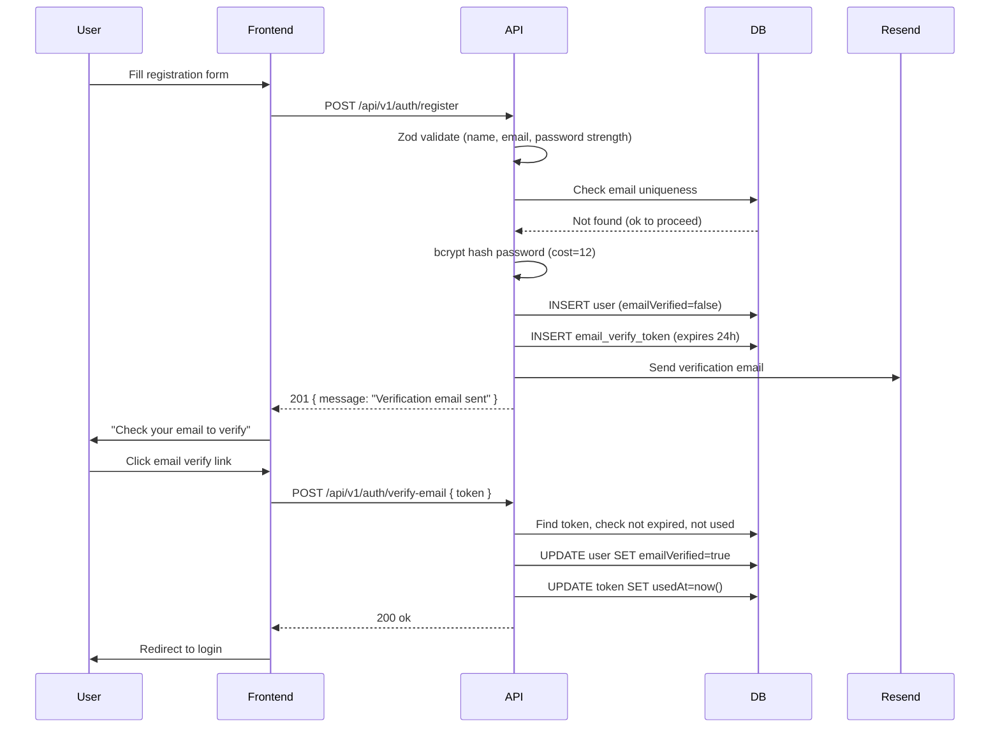
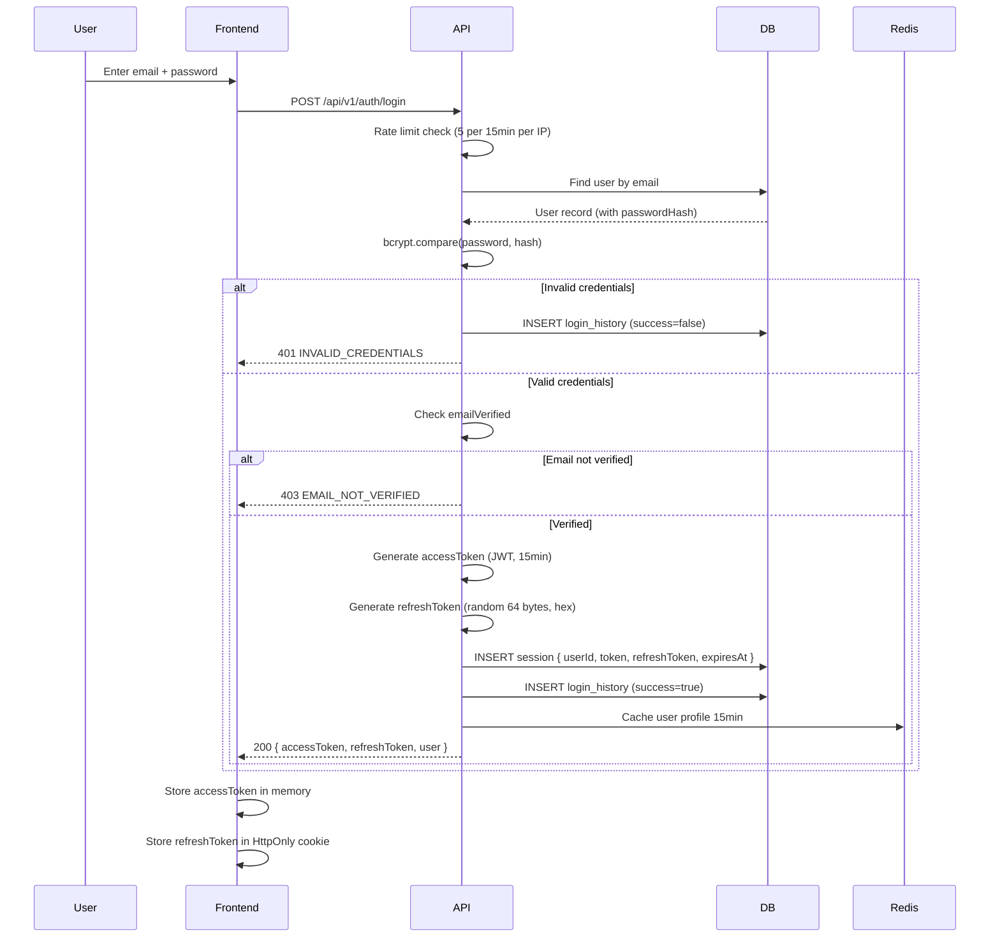
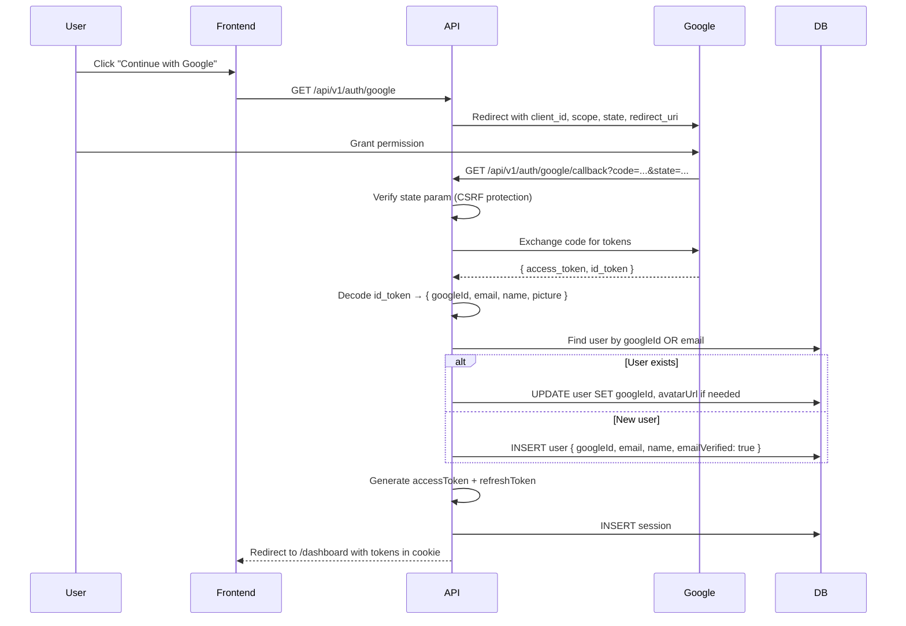
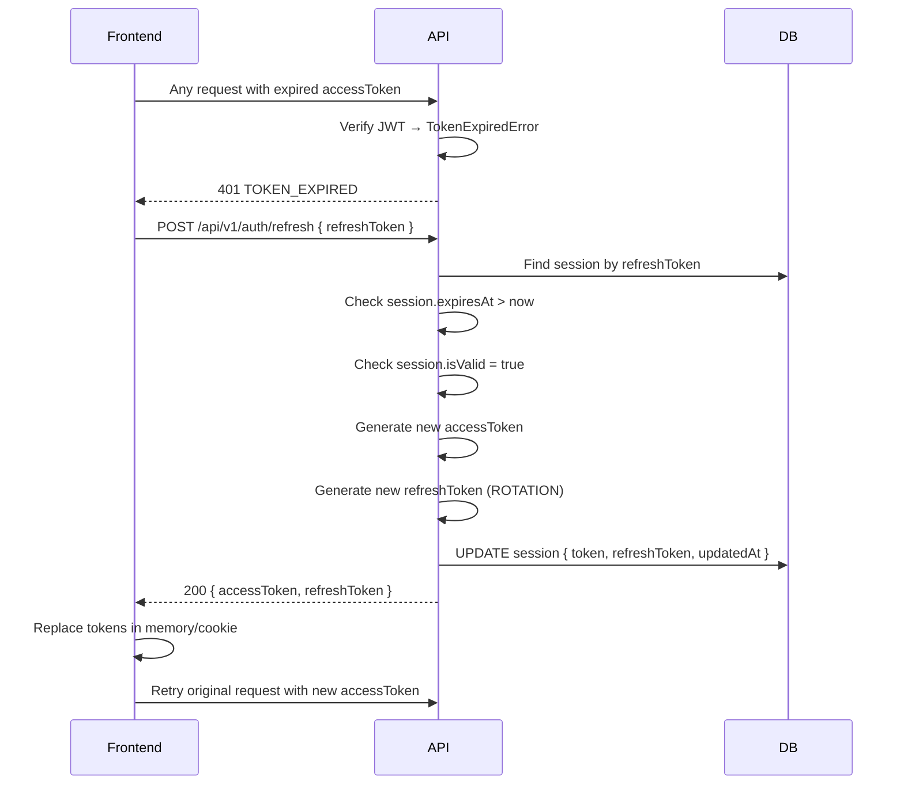

# 07 — Authentication

> **Document Type:** Auth Architecture & Implementation  
> **Audience:** Backend engineers, security engineers, AI coding agents  
> **Status:** Living Document

---

## Purpose

This document defines the complete authentication and session management architecture for FinanceFlow. It covers email/password auth, Google OAuth, JWT lifecycle, refresh token rotation, multi-device sessions, and security controls. Every auth-related implementation decision must trace back here.

---

## 1. Auth Strategy Overview

FinanceFlow uses **Auth.js (NextAuth v5)** as the auth framework, with:
- **Email + Password** (custom credentials provider)
- **Google OAuth 2.0**
- **JWT access tokens** (short-lived, 15 minutes)
- **Refresh tokens** (long-lived, 30 days, stored in DB)
- **HttpOnly secure cookies** for refresh token storage
- **Session-per-device** tracking for security visibility

### Why Auth.js?

| Concern | Decision |
|---------|----------|
| OAuth complexity | Auth.js abstracts Google OAuth, PKCE, state param |
| Session management | Built-in, extensible |
| Next.js integration | First-class App Router support |
| Flexibility | Custom credentials provider + JWT strategy |
| Security | Handles CSRF, state verification out of the box |

### Why JWT + Refresh Token (not DB sessions)?

- **Stateless access tokens** → no DB lookup on every API request (low latency)
- **Short TTL (15 min)** → compromised tokens expire quickly
- **Refresh tokens in DB** → revocation is possible (logout, suspicious activity)
- **Best of both worlds:** performance of stateless JWT + security of server-side revocation

---

## 2. Auth Flows

### 2.1 Email Registration Flow



### 2.2 Email Login Flow



### 2.3 Google OAuth Flow



### 2.4 Token Refresh Flow



**Refresh Token Rotation:** Every refresh token use generates a new refresh token. The old one is invalidated. This means a stolen refresh token can only be used once — the next time the legitimate user refreshes, the stolen token fails, alerting to a possible compromise.

---

## 3. JWT Structure

### Access Token Payload
```json
{
  "sub": "user-uuid",
  "email": "arjun@example.com",
  "name": "Arjun Mehta",
  "plan": "PREMIUM",
  "isAdmin": false,
  "sessionId": "session-uuid",
  "iat": 1717200000,
  "exp": 1717200900
}
```

### JWT Configuration
| Property | Value | Reason |
|----------|-------|--------|
| Algorithm | `HS256` | Sufficient for server-to-server. Switch to `RS256` when extracting microservices |
| TTL | 15 minutes | Short enough to limit compromise window |
| Secret rotation | Quarterly (or on breach) | Keep in `JWT_SECRET` env var |
| Claims | Minimal | Only what middleware needs — no PII beyond email |

### Never Put in JWT
- Password hash
- Full user object
- Bank account numbers
- Any secrets

---

## 4. Password Security

| Property | Implementation |
|----------|---------------|
| Hashing algorithm | `bcrypt` with cost factor `12` |
| Minimum length | 8 characters |
| Complexity | At least 1 uppercase, 1 lowercase, 1 digit |
| Breach check | HaveIBeenPwned API on registration (Phase 2) |
| Reset token TTL | 1 hour |
| Reset token entropy | `crypto.randomBytes(32).toString('hex')` |
| Token hashed in DB | Yes — store `sha256(token)` in DB, compare on reset |

```typescript
// Password hashing
import bcrypt from 'bcryptjs'

const SALT_ROUNDS = 12

export async function hashPassword(password: string): Promise<string> {
  return bcrypt.hash(password, SALT_ROUNDS)
}

export async function verifyPassword(password: string, hash: string): Promise<boolean> {
  return bcrypt.compare(password, hash)
}

// Secure token generation
import { randomBytes, createHash } from 'crypto'

export function generateSecureToken(): { raw: string; hashed: string } {
  const raw = randomBytes(32).toString('hex')
  const hashed = createHash('sha256').update(raw).digest('hex')
  return { raw, hashed }
}
```

---

## 5. Session Management

### Session Lifecycle
| Event | Action |
|-------|--------|
| Login | Create new session record |
| Token refresh | Update session with new tokens |
| Logout | Set `session.isValid = false` |
| Password change | Invalidate ALL sessions for user |
| Suspicious login | Alert user, optionally invalidate all sessions |
| Session expiry | Cleanup job removes expired sessions daily |

### Multi-Device Support
Each login creates a new session row. Users can see all active sessions via `GET /api/v1/users/me/sessions` and revoke any of them remotely.

### Concurrent Session Limits
| Plan | Max Sessions |
|------|-------------|
| FREE | 3 |
| PREMIUM | 10 |
| FAMILY | 15 |
| BUSINESS | 25 |

When the limit is reached, the oldest session is automatically invalidated.

---

## 6. Middleware Implementation

```typescript
// src/server/middleware/auth.middleware.ts

import { NextRequest } from 'next/server'
import { verifyJWT } from '@/lib/jwt'
import { prisma } from '@/lib/prisma'

export interface AuthenticatedRequest extends NextRequest {
  user: {
    id: string
    email: string
    plan: string
    isAdmin: boolean
    sessionId: string
  }
}

export async function withAuth(
  handler: (req: AuthenticatedRequest) => Promise<Response>
) {
  return async (request: NextRequest) => {
    const authHeader = request.headers.get('Authorization')
    
    if (!authHeader?.startsWith('Bearer ')) {
      return ApiResponse.error('UNAUTHORIZED', 'Authentication required', 401)
    }
    
    const token = authHeader.split(' ')[1]
    
    try {
      const payload = await verifyJWT(token)
      
      // Attach user to request
      ;(request as AuthenticatedRequest).user = {
        id: payload.sub,
        email: payload.email,
        plan: payload.plan,
        isAdmin: payload.isAdmin,
        sessionId: payload.sessionId,
      }
      
      return handler(request as AuthenticatedRequest)
    } catch (error) {
      if (error.name === 'TokenExpiredError') {
        return ApiResponse.error('TOKEN_EXPIRED', 'Access token has expired', 401)
      }
      return ApiResponse.error('INVALID_TOKEN', 'Invalid access token', 401)
    }
  }
}

// Usage in route handler
export const POST = withAuth(async (req) => {
  const userId = req.user.id
  // ...
})
```

---

## 7. Auth.js Configuration

```typescript
// src/lib/auth.ts
import NextAuth from 'next-auth'
import Google from 'next-auth/providers/google'
import Credentials from 'next-auth/providers/credentials'
import { prisma } from '@/lib/prisma'
import { verifyPassword } from '@/shared/utils/password'

export const { handlers, auth, signIn, signOut } = NextAuth({
  providers: [
    Google({
      clientId: process.env.GOOGLE_CLIENT_ID!,
      clientSecret: process.env.GOOGLE_CLIENT_SECRET!,
    }),
    Credentials({
      async authorize(credentials) {
        const { email, password } = credentials as { email: string; password: string }
        const user = await prisma.user.findUnique({ where: { email } })
        if (!user || !user.passwordHash) return null
        const valid = await verifyPassword(password, user.passwordHash)
        if (!valid) return null
        return { id: user.id, email: user.email, name: user.name, plan: user.plan }
      }
    })
  ],
  callbacks: {
    async jwt({ token, user, account }) {
      if (user) {
        token.userId = user.id
        token.plan = user.plan
        token.isAdmin = user.isAdmin
      }
      return token
    },
    async session({ session, token }) {
      session.user.id = token.userId
      session.user.plan = token.plan
      session.user.isAdmin = token.isAdmin
      return session
    }
  },
  pages: {
    signIn: '/login',
    error: '/login',
    verifyRequest: '/verify-email',
  },
  session: { strategy: 'jwt' },
  secret: process.env.AUTH_SECRET,
})
```

---

## 8. Security Checklist

- [ ] Passwords hashed with bcrypt (cost 12+)
- [ ] JWT access tokens expire in 15 minutes
- [ ] Refresh tokens rotated on every use
- [ ] Refresh tokens stored in HttpOnly, Secure, SameSite=Strict cookies
- [ ] Email verification required before first login
- [ ] Password reset tokens expire in 1 hour and are single-use
- [ ] Reset tokens are hashed in DB (never stored in plain text)
- [ ] Login attempts rate limited (5 per 15 min per IP)
- [ ] Failed login attempts logged
- [ ] Account lockout after 10 consecutive failures (Phase 2)
- [ ] Google OAuth state parameter verified (CSRF)
- [ ] All sessions invalidated on password change
- [ ] Session listing available to users
- [ ] Remote session revocation available
- [ ] Suspicious login detection (new country/IP) alerts
