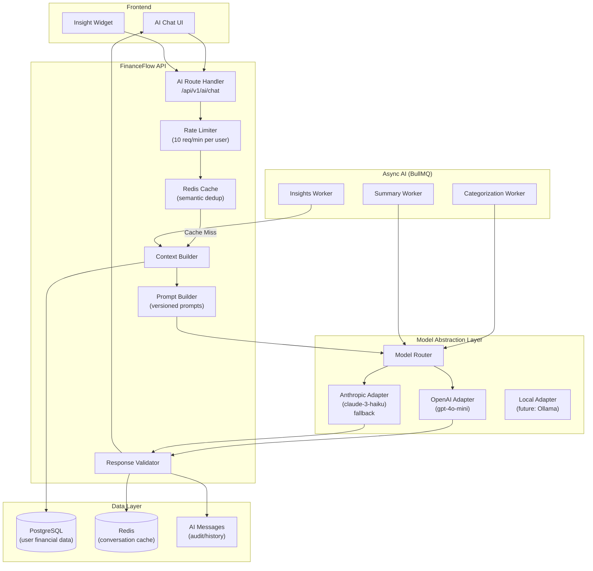
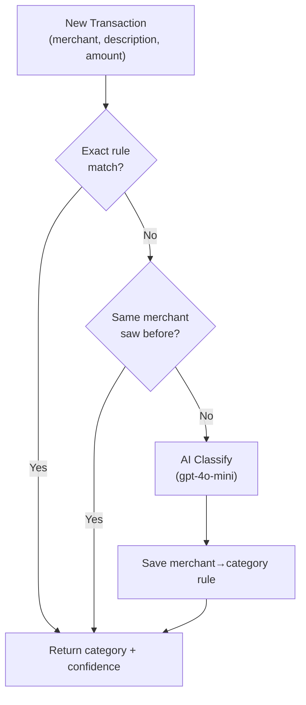

# 12 — AI Architecture

> **Document Type:** AI Systems Design  
> **Audience:** AI engineers, backend engineers, AI coding agents  
> **Status:** Living Document

---

## Purpose

This document defines the complete AI architecture for FinanceFlow — covering the AI Financial Assistant, smart categorization, prompt engineering, model abstraction, cost controls, hallucination mitigation, and the AI analytics pipeline. All AI features must be built according to this architecture.

---

## 1. AI Features Overview

| Feature | Type | Latency Target | Cost Sensitivity |
|---------|------|---------------|-----------------|
| AI Financial Assistant (chat) | LLM (conversational) | < 3s streaming | High |
| Smart Categorization | LLM or fine-tuned classifier | < 500ms | Very High |
| Proactive Insights | LLM (async, batch) | < 30s (background) | Medium |
| Weekly Financial Summary | LLM (async, scheduled) | Minutes (batch) | Low |
| Spending Pattern Detection | Rule-based + LLM validation | < 1s | Medium |

---

## 2. Architecture Principles

1. **Never call LLMs from the frontend.** All AI requests go through our API. This protects API keys, enables caching, logging, and abuse prevention.
2. **Always validate AI responses** before surfacing to users. Financial data hallucinated by AI is worse than no answer.
3. **Context is king.** A generic LLM response is useless. Every AI request must include the user's relevant financial context.
4. **Cache aggressively.** Identical questions with the same data context should hit the cache, not the LLM.
5. **Fail gracefully.** If the AI service is unavailable, the product must still function. AI is enhancement, not a dependency for core features.
6. **Track every token.** AI costs money. Every model call must be logged with token usage for cost attribution and optimization.

---

## 3. System Architecture Diagram



---

## 4. Model Abstraction Layer

This layer insulates the rest of the codebase from specific AI providers. Switching providers requires changing only this layer.

```typescript
// src/features/ai/model-provider.interface.ts
export interface AIModelProvider {
  complete(params: CompletionParams): Promise<CompletionResult>
  stream(params: CompletionParams): AsyncIterable<CompletionChunk>
}

export interface CompletionParams {
  system: string
  messages: AIMessage[]
  maxTokens: number
  temperature: number
  model?: string
}

export interface CompletionResult {
  content: string
  promptTokens: number
  completionTokens: number
  totalTokens: number
  modelUsed: string
  latencyMs: number
  cached: boolean
}
```

```typescript
// src/features/ai/adapters/openai.adapter.ts
import OpenAI from 'openai'
import { env } from '@/lib/env'
import type { AIModelProvider, CompletionParams, CompletionResult } from '../model-provider.interface'

export class OpenAIAdapter implements AIModelProvider {
  private client: OpenAI
  private defaultModel = 'gpt-4o-mini'

  constructor() {
    this.client = new OpenAI({ apiKey: env.OPENAI_API_KEY })
  }

  async complete(params: CompletionParams): Promise<CompletionResult> {
    const start = Date.now()
    const model = params.model ?? this.defaultModel

    const response = await this.client.chat.completions.create({
      model,
      messages: [
        { role: 'system', content: params.system },
        ...params.messages.map(m => ({ role: m.role, content: m.content })),
      ],
      max_tokens: params.maxTokens,
      temperature: params.temperature,
    })

    const choice = response.choices[0]
    return {
      content: choice.message.content ?? '',
      promptTokens: response.usage?.prompt_tokens ?? 0,
      completionTokens: response.usage?.completion_tokens ?? 0,
      totalTokens: response.usage?.total_tokens ?? 0,
      modelUsed: model,
      latencyMs: Date.now() - start,
      cached: false,
    }
  }

  async *stream(params: CompletionParams): AsyncIterable<CompletionChunk> {
    const model = params.model ?? this.defaultModel
    const stream = await this.client.chat.completions.create({
      model,
      messages: [
        { role: 'system', content: params.system },
        ...params.messages.map(m => ({ role: m.role, content: m.content })),
      ],
      max_tokens: params.maxTokens,
      temperature: params.temperature,
      stream: true,
    })

    for await (const chunk of stream) {
      const delta = chunk.choices[0]?.delta?.content
      if (delta) yield { content: delta }
    }
  }
}
```

```typescript
// src/features/ai/model-router.ts
// Routes to best model based on task type and user plan
export class ModelRouter {
  constructor(
    private openai: OpenAIAdapter,
    private anthropic: AnthropicAdapter
  ) {}

  getProviderForTask(task: AITask, plan: UserPlan): AIModelProvider {
    switch (task) {
      case 'CHAT':
        return plan === 'PREMIUM' ? this.openai : this.openai  // gpt-4o-mini for all tiers
      case 'CATEGORIZE':
        return this.openai  // Cheap, fast: gpt-4o-mini
      case 'INSIGHT':
        return this.openai
      default:
        return this.openai
    }
  }

  // Fallback to Anthropic if OpenAI fails
  async completeWithFallback(params: CompletionParams, task: AITask, plan: UserPlan) {
    try {
      return await this.getProviderForTask(task, plan).complete(params)
    } catch (error) {
      logger.warn({ err: error, task }, 'Primary AI provider failed, trying fallback')
      return await this.anthropic.complete(params)
    }
  }
}
```

---

## 5. Context Builder

The context builder is the most important component. It fetches the right user data and formats it for the LLM.

```typescript
// src/features/ai/context-builder.ts

export interface FinancialContext {
  currentMonth: {
    totalIncome: string
    totalExpenses: string
    netSavings: string
    topCategories: Array<{ name: string; amount: string; percentage: number }>
  }
  wallets: Array<{ name: string; type: string; balance: string }>
  recentTransactions: Array<{
    date: string; merchant: string; amount: string; type: string; category: string
  }>
  budgets: Array<{
    category: string; limit: string; spent: string; percentage: number
  }>
  activeGoals: Array<{
    name: string; target: string; current: string; percentage: number; daysLeft: number | null
  }>
  userProfile: {
    name: string; plan: string; currency: string
  }
}

export class ContextBuilder {
  constructor(
    private transactionRepo: TransactionRepository,
    private walletRepo: WalletRepository,
    private budgetRepo: BudgetRepository,
    private goalRepo: GoalRepository,
  ) {}

  async buildForChat(userId: string, month: Date): Promise<FinancialContext> {
    const [summary, wallets, recentTxns, budgets, goals, user] = await Promise.all([
      this.transactionRepo.getMonthlySummary(userId, month),
      this.walletRepo.findAll(userId),
      this.transactionRepo.findRecent(userId, { limit: 20 }),
      this.budgetRepo.findWithSpend(userId, month),
      this.goalRepo.findActive(userId),
      userRepo.findById(userId),
    ])

    return {
      currentMonth: {
        totalIncome: summary.income.toFixed(2),
        totalExpenses: summary.expenses.toFixed(2),
        netSavings: summary.income.minus(summary.expenses).toFixed(2),
        topCategories: summary.topCategories,
      },
      wallets: wallets.map(w => ({
        name: w.name,
        type: w.type,
        balance: w.balance.toFixed(2),
      })),
      recentTransactions: recentTxns.map(tx => ({
        date: tx.transactionDate.toISOString().split('T')[0],
        merchant: tx.merchant ?? tx.description ?? 'Unknown',
        amount: tx.amount.toFixed(2),
        type: tx.type,
        category: tx.category?.name ?? 'Uncategorized',
      })),
      budgets: budgets.map(b => ({
        category: b.category?.name ?? 'Overall',
        limit: b.limitAmount.toFixed(2),
        spent: b.spentAmount.toFixed(2),
        percentage: b.limitAmount.isZero()
          ? 0
          : b.spentAmount.div(b.limitAmount).times(100).toNumber(),
      })),
      activeGoals: goals.map(g => ({
        name: g.name,
        target: g.targetAmount.toFixed(2),
        current: g.currentAmount.toFixed(2),
        percentage: g.targetAmount.isZero()
          ? 0
          : g.currentAmount.div(g.targetAmount).times(100).toNumber(),
        daysLeft: g.targetDate
          ? Math.ceil((g.targetDate.getTime() - Date.now()) / 86400000)
          : null,
      })),
      userProfile: {
        name: user.name,
        plan: user.plan,
        currency: user.currency,
      },
    }
  }
}
```

---

## 6. Prompt Builder (Versioned Prompts)

Prompts are versioned and stored in code, not in a database. This ensures prompts are tracked in git, reviewed in PRs, and tied to specific deployments.

```typescript
// src/features/ai/prompts/v1/system.prompt.ts
export const SYSTEM_PROMPT_V1 = (context: FinancialContext) => `
You are FinanceFlow's AI Financial Assistant — a knowledgeable, friendly, and precise financial advisor.

## Your Role
Help ${context.userProfile.name} understand their finances, make better spending decisions, and achieve their financial goals.

## User's Current Financial Snapshot (${new Date().toLocaleDateString('en-IN', { month: 'long', year: 'numeric' })})
- **Income this month:** ₹${context.currentMonth.totalIncome}
- **Expenses this month:** ₹${context.currentMonth.totalExpenses}
- **Net savings:** ₹${context.currentMonth.netSavings}

**Top Spending Categories:**
${context.currentMonth.topCategories.map(c => `- ${c.name}: ₹${c.amount} (${c.percentage.toFixed(1)}%)`).join('\n')}

**Wallets:**
${context.wallets.map(w => `- ${w.name} (${w.type}): ₹${w.balance}`).join('\n')}

**Budget Status:**
${context.budgets.map(b => `- ${b.category}: ₹${b.spent} / ₹${b.limit} (${b.percentage.toFixed(0)}% used)`).join('\n')}

**Active Goals:**
${context.activeGoals.map(g => `- ${g.name}: ₹${g.current} / ₹${g.target} (${g.percentage.toFixed(0)}%)${g.daysLeft !== null ? ` — ${g.daysLeft} days left` : ''}`).join('\n')}

**Recent Transactions (last 20):**
${context.recentTransactions.map(tx => `- ${tx.date}: ${tx.merchant} — ₹${tx.amount} (${tx.category})`).join('\n')}

## Your Rules
1. **Only discuss what you know from the data above.** Do NOT invent, guess, or hallucinate financial figures.
2. **Always refer to amounts in Indian Rupees (₹)** unless the user specifies otherwise.
3. **Be specific.** Reference actual numbers from the data, not generic advice.
4. **Be concise but complete.** Answer the question asked; don't pad with unnecessary caveats.
5. **If you cannot answer from the provided data,** say so clearly: "I don't have enough data to answer that. You could [suggest where to look]."
6. **Never provide legal, tax, or investment advice** beyond general financial literacy. Recommend consulting a professional for those.
7. **Be encouraging but honest.** If the user is overspending, say so kindly but clearly.

## Response Format
- Use markdown formatting in responses
- Use ₹ symbol for all currency values
- Keep responses under 300 words unless a detailed breakdown is explicitly requested
- Use bullet points for lists of items
`.trim()
```

### Prompt Versioning System

```typescript
// src/features/ai/prompts/prompt-registry.ts
export const PROMPT_VERSIONS = {
  system: {
    v1: SYSTEM_PROMPT_V1,
    v2: SYSTEM_PROMPT_V2,  // When a new version is released
    current: 'v2',
  },
  categorize: {
    v1: CATEGORIZE_PROMPT_V1,
    current: 'v1',
  },
  insight: {
    v1: INSIGHT_PROMPT_V1,
    current: 'v1',
  },
}

export function getPrompt(type: keyof typeof PROMPT_VERSIONS, version?: string) {
  const registry = PROMPT_VERSIONS[type]
  const v = version ?? registry.current
  return registry[v]
}
```

---

## 7. Response Validator

All AI responses must pass validation before reaching the user.

```typescript
// src/features/ai/response-validator.ts
export class ResponseValidator {
  
  validateChatResponse(response: string): ValidationResult {
    const issues: string[] = []
    
    // 1. Check for hallucinated financial figures (numbers not in context)
    // This is complex — Phase 2: use regex to extract numbers and cross-check with context
    
    // 2. Check minimum length
    if (response.trim().length < 10) {
      issues.push('Response is too short to be useful')
    }
    
    // 3. Check for refusal patterns that should be surfaced differently
    const refusalPatterns = [
      /i cannot provide/i,
      /i don't have access/i,
      /as an ai/i,
    ]
    
    // 4. Check for dangerous financial advice patterns
    const dangerousPatterns = [
      /guaranteed returns/i,
      /risk-free investment/i,
      /you should definitely invest/i,
    ]
    
    for (const pattern of dangerousPatterns) {
      if (pattern.test(response)) {
        issues.push('Response contains potentially misleading financial advice')
      }
    }
    
    return {
      isValid: issues.length === 0,
      issues,
      sanitized: this.sanitize(response),
    }
  }
  
  private sanitize(response: string): string {
    // Remove any accidental PII if detected
    // Trim excessive whitespace
    return response.trim()
  }
}
```

---

## 8. Caching Strategy

### Response Cache (Redis)
Cache AI chat responses where the question and financial context hash are the same.

```typescript
// Cache key = hash of (userId + question + context fingerprint)
const cacheKey = `ai:response:${userId}:${hashString(message + contextFingerprint)}`
const CACHE_TTL = 300  // 5 minutes — context changes frequently

const cached = await redis.get(cacheKey)
if (cached) return JSON.parse(cached)

const response = await modelRouter.complete(params)
await redis.setex(cacheKey, CACHE_TTL, JSON.stringify(response))
```

### Context Fingerprint
A lightweight hash of the user's financial state. If nothing changed, the cached response is valid.

```typescript
function buildContextFingerprint(context: FinancialContext): string {
  // Only include fields that materially change the response
  const fingerprint = {
    income: context.currentMonth.totalIncome,
    expenses: context.currentMonth.totalExpenses,
    walletCount: context.wallets.length,
    recentTxCount: context.recentTransactions.length,
    lastTxDate: context.recentTransactions[0]?.date,
  }
  return hashString(JSON.stringify(fingerprint))
}
```

---

## 9. Smart Categorization



```typescript
// src/features/ai/categorizer.ts
export class TransactionCategorizer {
  async categorize(
    input: { description: string; merchant: string; amount: string },
    userId: string,
    categories: Category[]
  ): Promise<{ categoryId: string; confidence: number; aiCategorized: boolean }> {
    
    // 1. Check exact rule match
    const rule = await this.ruleRepo.findByMerchant(input.merchant, userId)
    if (rule) {
      return { categoryId: rule.categoryId, confidence: 1.0, aiCategorized: false }
    }
    
    // 2. Check user's history for this merchant
    const historicalCategory = await this.txRepo.findMostCommonCategory(
      userId, input.merchant
    )
    if (historicalCategory && historicalCategory.confidence > 0.8) {
      return { ...historicalCategory, aiCategorized: false }
    }
    
    // 3. AI classification
    const categoryList = categories
      .map(c => `${c.id}:${c.name}`)
      .join(', ')
    
    const prompt = `
Categorize this transaction into exactly one of these categories.
Categories: ${categoryList}

Transaction:
- Merchant: ${input.merchant}
- Description: ${input.description}
- Amount: ₹${input.amount}

Respond with ONLY a JSON object: { "categoryId": "uuid", "confidence": 0.0-1.0 }
No other text.
`
    const response = await this.modelRouter.complete({
      system: 'You are a transaction categorization engine. Respond only with valid JSON.',
      messages: [{ role: 'user', content: prompt }],
      maxTokens: 100,
      temperature: 0,
    })
    
    try {
      const result = JSON.parse(response.content)
      const CategoryResultSchema = z.object({
        categoryId: z.string().uuid(),
        confidence: z.number().min(0).max(1),
      })
      const parsed = CategoryResultSchema.parse(result)
      
      // Save as rule if high confidence
      if (parsed.confidence > 0.9 && input.merchant) {
        await this.ruleRepo.create({
          userId,
          merchant: input.merchant,
          categoryId: parsed.categoryId,
        })
      }
      
      return { ...parsed, aiCategorized: true }
    } catch {
      // AI response was invalid — return uncategorized
      return { categoryId: 'uncategorized-id', confidence: 0, aiCategorized: false }
    }
  }
}
```

---

## 10. AI Cost Optimization

### Cost Tracking Per Request
```typescript
// Every AI completion saves cost metrics
await prisma.aIMessage.create({
  data: {
    conversationId,
    role: 'assistant',
    content: response.content,
    promptTokens: response.promptTokens,
    completionTokens: response.completionTokens,
    modelUsed: response.modelUsed,
    latencyMs: response.latencyMs,
    cached: response.cached,
  }
})
```

### Cost Limits Per User Plan
| Plan | Daily AI Requests | Monthly Token Budget |
|------|------------------|---------------------|
| FREE | 5 | ~50,000 tokens |
| PREMIUM | 50 | ~500,000 tokens |
| BUSINESS | 200 | ~2,000,000 tokens |

### Model Selection by Task Cost
| Task | Model | Avg Cost/Request |
|------|-------|-----------------|
| Chat response | gpt-4o-mini | ~$0.0003 |
| Categorization | gpt-4o-mini | ~$0.00005 |
| Insight generation | gpt-4o-mini | ~$0.0002 |
| Weekly summary | gpt-4o-mini | ~$0.0005 |

### Cost Alerts
- Alert when daily AI spend exceeds $50
- Alert when a single user consumes > 10x their plan's expected tokens
- Weekly cost report to admin dashboard

---

## 11. Anti-Patterns

| Anti-Pattern | Why Dangerous | Correct Approach |
|-------------|--------------|------------------|
| Call LLM from frontend | Exposes API key, no rate limit | Always via backend API |
| Trust AI numbers as financial truth | Hallucination risk | Cross-check with DB data |
| No timeout on AI calls | Hangs request indefinitely | 30s timeout, graceful error |
| Sending full transaction history in context | Token waste, latency | Send summarized context only |
| Single system prompt hardcoded | Can't improve without deploy | Versioned prompt registry |
| No token logging | No cost visibility | Log every completion |
| AI as a blocking dependency | Makes core features unreliable | Always have non-AI fallback |
